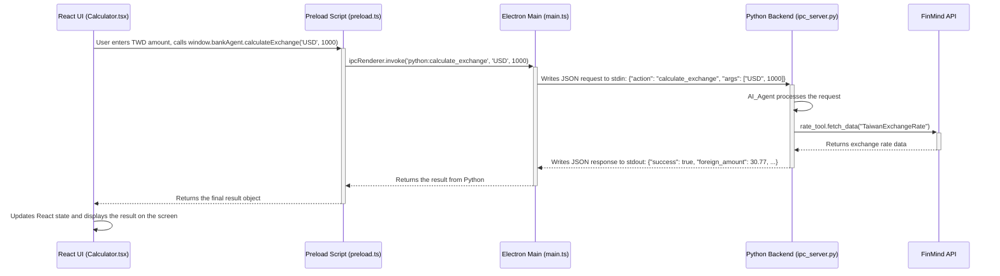

# 智慧商用計算機專案分析報告

本報告旨在深入分析「智慧商用計算機」專案的架構與功能。

## 8.2.1 應用情境說明

### 目標使用者
本應用程式的目標使用者為需要進行商業計算，特別是涉及即時匯率換算的商務人士、財務人員或國際貿易從業人員。

### 操作流程
1.  **模式切換**：使用者在介面上可以選擇使用「一般計算機」模式或「銀行專家 (Bank Agent)」模式。
2.  **一般計算**：在「一般計算機」模式下，使用者可以進行加、減、乘、除等基本四則運算，操作方式與標準計算機無異。
3.  **匯率查詢與換算**：
    *   切換至「銀行專家」模式。
    *   從下拉選單中選擇目標外幣（例如：美金 USD、日圓 JPY）。
    *   在輸入框中輸入要換算的新台幣 (TWD) 金額。
    *   應用程式會自動向後端發送請求，取得最新的銀行現金賣出匯率。
    *   計算完成後，介面會顯示換算後的外幣金額以及所使用的匯率。

### 預期功能
*   提供標準的計算機功能。
*   提供即時的匯率查詢與換算功能，目前支援台幣對多種外幣。
*   介面清晰，操作直觀，能即時顯示計算結果。
*   (潛在功能) 後端具備解析自然語言指令的能力，未來可擴充支援語音或文字指令操作，例如「一萬台幣可以換多少日幣」。

## 8.2.2 變數說明

| 變數名稱 | 位置 (檔案) | 型態 | 意義 |
| :--- | :--- | :--- | :--- |
| `displayValue` | `Calculator.tsx` | `string` | 在計算機螢幕上顯示的目前數值或算式。 |
| `isBankAgentMode` | `Calculator.tsx` | `boolean` | 標示當前是否為「銀行專家」模式。 |
| `selectedCurrency` | `Calculator.tsx` | `string` | 使用者在銀行專家模式下選擇的目標貨幣代碼 (如 "USD")。 |
| `twdAmount` | `Calculator.tsx` | `string` | 使用者輸入的待換算新台幣金額。 |
| `exchangeResult` | `Calculator.tsx` | `object` | 儲存從後端返回的匯率換算結果，包含外幣金額、匯率等資訊。 |
| `ipc_server` | `ipc_server.py` | `IPCServer` | 後端 IPC (行程間通訊) 伺服器物件，負責與 Electron 主行程溝通。 |
| `agent` | `ipc_server.py` | `AI_Agent` | 核心商業邏輯代理物件，負責處理所有匯率相關的請求。 |
| `rate_tool` | `agent.py` | `TaiwanExchangeRate` | 匯率工具物件，專門用來從 FinMind API 獲取台灣銀行匯率資料。 |

## 8.2.3 程式流程圖 (Mermaid)

此圖展示了使用者在前端進行匯率換算時，從前端介面到後端處理再返回結果的完整流程。



## 8.2.4 函式說明

| 函式名稱 | 位置 (檔案) | 傳入值 | 回傳值 | 意義 |
| :--- | :--- | :--- | :--- | :--- |
| `calculateExchange` | `Calculator.tsx` | `currency: string`, `amount: number` | `Promise<object>` | (前端) 當使用者輸入金額時觸發，呼叫 `window.bankAgent` 進行匯率計算。 |
| `sendToPython` | `main.ts` | `data: object` | `Promise<any>` | (Electron) 將來自前端的請求打包成 JSON 格式，透過 `stdin` 發送給 Python 後端行程。 |
| `handle_request` | `ipc_server.py` | `request: dict` | `dict` | (後端) 解析來自 `stdin` 的 JSON 請求，根據 `action` 欄位路由到 `AI_Agent` 的對應方法。 |
| `calculate_exchange` | `agent.py` | `currency: str`, `amount_twd: float` | `dict` | (後端) 核心業務邏輯。呼叫匯率工具取得匯率，執行換算，並回傳包含結果的字典。 |
| `get_latest_rate` | `ExchangeRate.py` | `currency_code: str` | `float` \| `None` | (後端) 從已獲取的資料中，篩選並回傳指定貨幣的最新現金賣出價。 |

## 8.2.5 程式碼

### 前端核心邏輯 (`frontend/src/components/Calculator.tsx`)
```typescript
// ... (部分代碼)
  const calculateExchange = async (currency: string, amount: number) => {
    if (isBankAgentMode && currency && amount > 0) {
      try {
        console.log(`Calculating exchange for ${amount} TWD to ${currency}`);
        const result = await window.bankAgent.calculateExchange(currency, amount);
        console.log('Exchange result:', result);
        if (result.success) {
          setExchangeResult(result);
          setDisplayValue(result.foreign_amount.toFixed(2));
        } else {
          setDisplayValue('Error');
          setExchangeResult({
            success: false,
            foreign_amount: 0,
            rate: 0,
            message: result.message
          });
        }
      } catch (error) {
        console.error('Exchange calculation failed:', error);
        setDisplayValue('Error');
      }
    }
  };
// ... (部分代碼)
```

### 後端核心邏輯 (`backend/agent/agent.py`)
```python
# ... (部分代碼)
class AI_Agent:
    def __init__(self):
        self.rate_tool = TaiwanExchangeRate()

    def calculate_exchange(self, currency: str, amount_twd: float):
        """
        Calculates the foreign currency amount from a TWD amount.
        """
        # ... (錯誤處理)

        rate = self.rate_tool.get_latest_rate(currency)
        if rate is None:
            return {"success": False, "message": f"無法獲取 {currency} 的匯率"}

        if amount_twd > 500000:
            return {"success": False, "message": "單筆換匯金額不得超過50萬台幣"}

        foreign_amount = amount_twd / rate
        return {
            "success": True,
            "foreign_amount": foreign_amount,
            "rate": rate,
            "twd_amount": amount_twd,
            "currency": currency
        }
# ... (部分代碼)
```

## 8.2.6 執行結果截圖

我無法直接產生圖片檔案。但是，我可以描述執行後的介面外觀：

假設使用者在「銀行專家」模式下，選擇了「USD」，並輸入了 `1000`。

1.  畫面上方的計算機顯示區會短暫顯示 `...` 或保持原樣，直到計算完成。
2.  計算完成後（約 1-2 秒），顯示區的數字會更新為換算後的美金金額，例如 `30.77`。
3.  在顯示區下方，會出現一行詳細資訊，內容類似：「`換匯結果: 1000 TWD = 30.77 USD (匯率: 32.5)`」。

整個介面風格簡潔，以深色背景為主，按鈕和文字清晰易讀。

## 8.2.7 與小算盤的比較

| 比較指標 | 本專案 (智慧商用計算機) | 一般小算盤 (以作業系統內建為例) |
| :--- | :--- | :--- |
| **核心功能** | 包含基本運算，並整合了**即時匯率換算**。 | 僅提供基本運算、工程計算或單位換算。 |
| **資料來源** | 運算資料由使用者輸入，匯率資料**從外部 API (FinMind) 即時獲取**。 | 所有資料均由使用者手動輸入。 |
| **技術架構** | **C/S 架構** (Client-Server)。使用 Electron + React 作為客戶端，Python 作為後端伺服器。 | 單體應用程式，所有邏輯都在本地端執行。 |
| **網路需求** | **需要網路連線**才能使用匯率換算功能。 | 完全離線，無需網路。 |
| **擴充性** | **高**。後端 Python 架構清晰，易於增加新的金融工具或 AI 功能 (如自然語言處理)。 | **低**。功能固定，難以進行二次開發。 |
| **使用情境** | 適合需要**結合即時金融資訊**的商業計算。 | 適合快速、簡單的本地數學運算。 |

---

## 附錄 A：IPC (行程間通訊) 互動方式詳解

此專案的前後端通訊並非透過傳統的 HTTP API (如 RESTful API)，而是採用了基於**標準輸入/輸出 (stdin/stdout)** 的行程間通訊 (IPC) 機制。這種方式在 Electron 應用中相當常見，可以有效地管理和通訊由主程式衍生的子行程(在這裡是 Python 後端)。

整個流程可以拆解成以下四個步驟：

**步驟 1：前端呼叫 (Renderer Process)**
使用者在 React 介面 (`Calculator.tsx`) 上的操作會呼叫一個由 `preload.ts` 注入到全域 `window` 物件的方法。

```typescript
// frontend/src/components/Calculator.tsx
const result = await window.bankAgent.calculateExchange(currency, amount);
```

**步驟 2：預載腳本橋接 (Preload Script)**
`preload.ts` 扮演著橋樑的角色，它將前端的函式呼叫轉換成一個 IPC 事件，並透過 `ipcRenderer` 發送給 Electron 的主行程。這一步是確保前端沙盒環境安全性的關鍵。

```typescript
// frontend/electron/preload.ts
contextBridge.exposeInMainWorld('bankAgent', {
  calculateExchange: (currency: string, amount: number) => 
    ipcRenderer.invoke('python:calculate_exchange', currency, amount),
});
```

**步驟 3：主行程處理與轉發 (Main Process)**
Electron 主行程 (`main.ts`) 監聽名為 `'python:calculate_exchange'` 的 IPC 事件。收到事件後，它會將收到的參數打包成一個 JSON 物件，並將這個 JSON **作為一個字串寫入 Python 子行程的標準輸入 (`stdin`)**。

```typescript
// frontend/electron/main.ts
// 監聽來自前端的事件
ipcMain.handle('python:calculate_exchange', async (event, currency, amount) => {
  const requestId = Date.now().toString();
  // 透過 stdin 將 JSON 字串發送給 Python
  return sendToPython({
    action: 'calculate_exchange',
    args: [currency, amount],
    requestId: requestId
  });
});

// sendToPython 函式的核心邏輯
function sendToPython(data) {
  // ...
  pythonProcess.stdin.write(JSON.stringify(data) + '\n'); // 寫入 stdin
  // ...
}
```

**步驟 4：Python 後端接收、處理與回應**
Python 後端伺服器 (`ipc_server.py`) 在啟動後會進入一個無限迴圈，**持續監聽其自身的標準輸入 (`stdin`)**。
*   一旦讀取到一行新資料 (由步驟 3 的 `\n` 分隔)，它會將這行 JSON 字串解析成 Python 的字典。
*   接著，它會根據字典中的 `action` 欄位 (`'calculate_exchange'`)，呼叫 `AI_Agent` 中對應的處理函式。
*   處理完成後，`AI_Agent` 回傳一個結果字典。`ipc_server.py` 再將這個結果字典**序列化成 JSON 字串，並寫入到自己的標準輸出 (`stdout`)**。
*   Electron 的主行程會捕捉到 `stdout` 的輸出，並透過 `Promise` 將結果回傳給最前端的 React 介面，完成一次完整的通訊。

```python
# backend/ipc_server.py
class IPCServer:
    def run(self):
        for line in sys.stdin: # 迴圈監聽 stdin
            try:
                request = json.loads(line) # 解析 JSON 字串
                action = request.get("action")
                # ...
                result = self.handle_request(request) # 處理請求
            except json.JSONDecodeError:
                result = {"success": False, "message": "無效的 JSON 格式"}
            
            sys.stdout.write(json.dumps(result) + '\n') # 將結果寫入 stdout
            sys.stdout.flush()
```

## 附錄 B：匯率 API 存取方式詳解

後端並非直接將使用者的每次請求都轉發給外部 API，而是設計了一個 `TaiwanExchangeRate` 工具類 (`ExchangeRate.py`) 來統一管理匯率資料的獲取與快取，以提高效率和穩定性。

**步驟 1：觸發資料獲取**
當 `AI_Agent` 需要匯率資料時（在 `calculate_exchange` 方法中），它會呼叫 `rate_tool.get_latest_rate(currency)`。

**步驟 2：檢查快取與獲取新資料**
`get_latest_rate` 方法內部會先檢查本地是否有快取資料，以及資料是否過期（預設 600 秒）。如果沒有資料或資料過期，它會呼叫 `fetch_data()` 方法來從外部 API 抓取新資料。

**步驟 3：呼叫 FinMind API**
`fetch_data()` 方法是實際與外部 API 互動的地方。
*   它使用 `requests` 函式庫向 FinMind API 的特定端點發起 GET 請求。
*   API 端點 URL 為：`https://api.finmindtrade.com/api/v4/data`。
*   請求中會帶上必要的參數，其中最重要的兩個是：
    *   `dataset='TaiwanExchangeRate'`：告訴 API 我們需要的是台灣銀行的匯率資料。
    *   `start_date='YYYY-MM-DD'`：指定開始日期，以獲取最新的資料。

```python
# backend/tool/ExchangeRate.py
def fetch_data(self):
    # ...
    url = "https://api.finmindtrade.com/api/v4/data"
    params = {
        "dataset": "TaiwanExchangeRate",
        "start_date": (datetime.now() - timedelta(days=1)).strftime('%Y-%m-%d'),
    }
    # ...
    try:
        response = requests.get(url, params=params, timeout=10)
        response.raise_for_status() # 檢查 HTTP 錯誤
        data = response.json()
        
        if data.get('status') == 200 and 'data' in data:
            # 使用 pandas 將回傳的 JSON 資料轉換成 DataFrame
            self.exchange_rate_data = pd.DataFrame(data['data'])
            self.last_fetch_time = time.time()
            return True
    # ...
```

**步驟 4：資料處理與回傳**
*   API 回傳的資料是 JSON 格式，程式使用強大的 `pandas` 函式庫將其轉換為 DataFrame 格式，這是一種二維表格結構，非常便於進行資料篩選和處理。
*   `get_latest_rate` 方法接著會在這個 DataFrame 中，根據使用者請求的貨幣代碼 (如 "USD") 進行篩選，並從 `cash_sell` (現金賣出價) 欄位中提取最新的匯率值，最後回傳給 `AI_Agent` 進行計算。

這種將資料獲取、快取和處理封裝成一個獨立 "Tool" 的設計，是良好軟體架構的體現，讓主要業務邏輯 (`AI_Agent`) 更加清晰，也更容易在未來擴充或更換資料來源。
